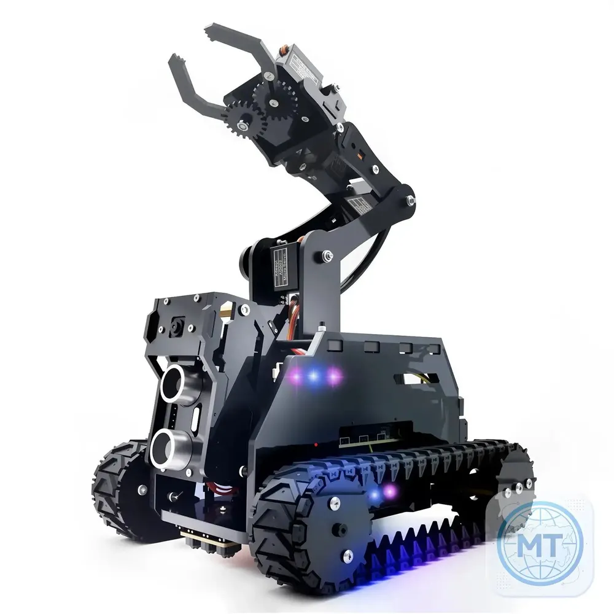
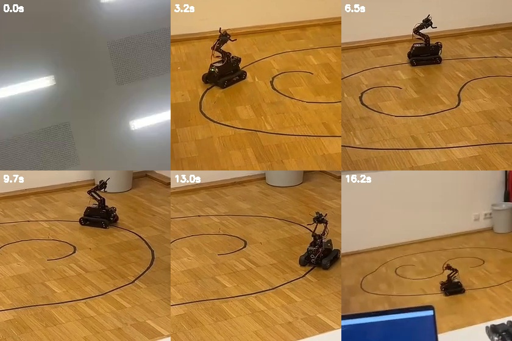
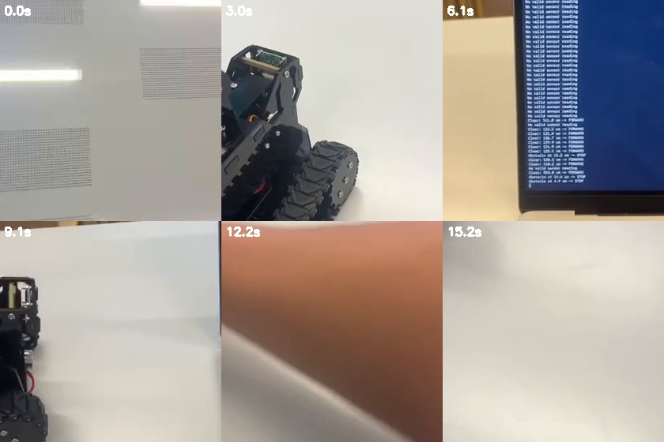

<div align="center">

```
    ____  ___   _____ ____     _________    _   ____ __
   / __ \/   | / ___// __ \   /_  __/   |  / | / / //_/
  / /_/ / /| | \__ \/ /_/ /    / / / /| | /  |/ / ,<
 / _, _/ ___ |___/ / ____/    / / / ___ |/ /|  / /| |
/_/ |_/_/  |_/____/_/        /_/ /_/  |_/_/ |_/_/ |_|

        R O B O T I C S   E X E R C I S E S
```


**A hands-on robotics curriculum for the Raspberry Pi / Adeept RaspTank — from blinking an LED to autonomous line following.**

</div>

## The Robot

The actual build — Raspberry Pi brain, ultrasonic "eyes", IR line sensors underneath, and two driven tracks:

<p align="center">
  
</p>

<details>
<summary>▶ ASCII rendering of the photo (click to expand)</summary>

```text
                                                                                         .
                             ..:..                                                        
                             .=***+=-:. .                                                 
                         .    ...:-++*+..--:.                                             
                        :+=.         -*+=+---:. .                                         
                    .....=*=.      .:=*+#%*=:--.....                                      
                  ...... .+*-.  .:=#%##%%%%%#=-++- .                                      
                  ....... .=*+=--#%%%####@%%@%*+==:                                       
                  .....     .-==+###%#%%%%%%%%@#+=-.                                      
                                .-++*#####%@@@@@%+*#=. .                                  
                                  ..:+%%%%%%%%%%%%#%%+. .                                 
                                      -%%%%%%#%%%%###%*-.                                 
                                       :::*##%%%%%%%###**:              .                 
                                           .:-*%%%@*-=#%%%*=:                             
                                               -%@@#++#%%%%%+.                            
                                             .-*@@@%**#%%%%%+.                            
                                         .:=*%@@%%#**%%%%+-:.                             
                                    .:+++*%@********+==%+                                 
                                  .-#%@@#*#%#*%+=*+-.-#=                                  
                                  .#@@@@*+#%#*#*++..+#-                                   
                                   :+@@@**#%#++**+=*=.                                    
                      ...::-:-==--:.-@@@@%*#*+++++-.                                      
                     .=****#*#*#=-#=-+***#***+++++                                .       
                     =@*+#%****#==++=+==#%*#*=++++                               ....     
                    .*@+*##=++****===**=#++%#*-+**=---------:::::                 .....   
                     =*+++++++*#%+===#**@%%#*==#*#%####%######**#:                ........
                     -%--**#%*+%%+=+#@%%##++++**###%%%#######****+.               ........
                      :**%=*%@#+*++%@@@%+*==+==*=+#%%%%##%%=-+*%**=               ........
                      .=%%-+*%%++*%%@@@@%+++***#*#%%%%%%##%***###**:            ..........
                      :%**=+**++*%@@@@@%++**###%%%%%%%%%###########*.          ...........
           .......    +@%@++-+=*%@@@@@%***###%%%%%%%%%%%%%%%%######*:       ..............
           .....   ...##++=+=++%@@@@@%***###%%%%@@@@@@@@@@@@@%%%####=        .............
            ..  .-==++*%+:+*%*#@@@@@%*###%%@@@@@@@%%%%%%%@@@@@@@%%%%#*****+=-.............
           .. .=***#%#+#-:-+#*%@@@@@%%@@@@@@@@@@%@%%%%%%%#%#%#%%%%%%@@@@@@%##=............
           ...*#**%@@@#++===++@@@@@##%@@@%%##**#*###%*##%%%%@%@@@@@@@%@@@%###*:...........
           . -%##%@@#%%@@@@%*=%%#%@@*%%*##++**#%######*##*@@@@@@@@@@@@@@@##**+- ....... ..
           . -###%@@%%%@@%@@%+@%#%@@**###**##%#%*+####+*##@@@@@@%@@@@%@@#=-===:........   
           ...=*#%@@@@%%+*#%%%@@%@@@**#%#%%%%%##*+####%@%%*++=-..:+@@@@#*+====..........  
           ... -+#%@@@@%#*+===+*##%@##%%%%@@%###%@####*+-::::-=*+##@@@@**#+=-.......:...  
            .....:+*###**+=-*++*+***####%@@@%####%#####*#*%#@@@@@@@@@@%+==-:-:::::..::..  
            ............  ..::==+%*==#%%%%@@%#####*+#%@@@@@@@@@%%#*+--:..:..::::::..::..  
            ................ ...::--=*#%%@@@@%###%##%@@@@@%#*+=-:........:::.:.:.::::...  
               ....................:::-=*%@@@@@%%%@@@%#*+=-:...............::::::::.....  
                          ............::-+*#%%%%#*+=-::.................................  
                                ..........::::::..............................  .....     
```

</details>

---

## Table of Contents

- [About](#about)
- [The Robot](#the-robot)
- [Exercise Modules](#exercise-modules)
- [Hardware Map](#hardware-map)
- [Setup](#setup)
- [Running the Exercises](#running-the-exercises)
- [Project Demonstration](#project-demonstration)
- [Achievement](#achievement)
- [Safety](#safety)
- [Contributing](#contributing)

---

## About

A progressive, hands-on robotics course built around an **Adeept RaspTank-style tracked robot** driven by a Raspberry Pi. Each module adds one real capability — sensing, actuation, or control logic — until the robot can drive a marked course on its own.

The design goals:

- **Progressive difficulty** — LEDs → distance sensing → motors → reactive behavior → closed-loop line following
- **Real hardware, real physics** — every script runs on the actual robot; calibration constants are documented and explained
- **Readable, hackable code** — scripts are intentionally standalone so each one can be studied, run, and modified in isolation

> Built as part of practical robotics study focused on understanding how sensors, control logic, and actuators work together in a real robot.

## Exercise Modules

| # | Module | What you learn | Scripts |
|---|--------|----------------|---------|
| 1 | **LEDs** | GPIO output, onboard LEDs, WS2812 RGB via SPI | `custom_led_pattern.py`, `ws2812_colors.py` |
| 2 | **Ultrasonic** | HC-SR04 distance measurement, noise filtering | `ultrasonic_exercise.py`, `ultrasonic_filter.py` |
| 3 | **Motors** | PWM motor control, calibrated straight driving and turning | `motor_speeds.py`, `move.py` |
| 4 | **Obstacle Avoidance** | Reactive control loops, threshold tuning | `obstacle_alert.py`, `obstacle_avoidance.py` |
| 5 | **Line Following** | IR sensor polarity, differential drive control, line-loss recovery | `line_sensor_raw.py`, `line_follow.py` |

## Hardware Map

Wiring and GPIO mappings used by all exercises (BCM numbering):

```
                    Raspberry Pi  ──  RaspTank
 ┌──────────────────────────────────────────────────────────────┐
 │                                                              │
 │  ULTRASONIC (HC-SR04)          MOTOR DRIVER (PCA9685 PWM)    │
 │  ├── TRIG ──► GPIO 23          ├── LEFT  track ── ch 2, 4    │
 │  └── ECHO ──► GPIO 24          └── RIGHT track ── ch 1, 3    │
 │                                                              │
 │  IR LINE SENSORS               LIGHTS                        │
 │  ├── LEFT   ◄── GPIO 22        ├── 3 onboard LEDs            │
 │  ├── MIDDLE ◄── GPIO 27        │     GPIO 9 / 25 / 11        │
 │  └── RIGHT  ◄── GPIO 17        └── 2 WS2812 RGB (spi_ws2812) │
 │                                                              │
 │  Robot library: /home/pi/raspTank/lib                        │
 └──────────────────────────────────────────────────────────────┘
```

> ⚠️ Check your own robot before running the scripts — motor direction, sensor polarity, and wiring can differ between RaspTank revisions.

## Setup

Clone the repository on the Raspberry Pi:

```bash
git clone https://github.com/nikgolobo/rasptank-robotics.git
cd rasptank-robotics
```

Create a virtual environment and install dependencies:

```bash
python3 -m venv .venv
source .venv/bin/activate
pip install -r requirements.txt
```

The Adeept-specific `motor` and `spi_ws2812` modules are expected to already exist on the robot at:

```text
/home/pi/raspTank/lib
```

## Running the Exercises

**1. LEDs**

```bash
python3 scripts/01_leds/custom_led_pattern.py
python3 scripts/01_leds/ws2812_colors.py
```

**2. Ultrasonic sensor**

```bash
sudo python3 scripts/02_ultrasonic/ultrasonic_exercise.py
sudo python3 scripts/02_ultrasonic/ultrasonic_filter.py
```

**3. Motor control**

```bash
sudo python3 scripts/03_motors/motor_speeds.py
sudo python3 scripts/03_motors/move.py
```

`move.py` contains the calibrated square-driving version with `TURN_TIME = 1.3`.

**4. Obstacle avoidance**

```bash
sudo python3 scripts/04_obstacle_avoidance/obstacle_alert.py
sudo python3 scripts/04_obstacle_avoidance/obstacle_avoidance.py
```

**5. Line following**

First inspect the raw IR readings, then run the follower:

```bash
sudo python3 scripts/05_line_following/line_sensor_raw.py
sudo python3 scripts/05_line_following/line_follow.py
```

The current `line_follow.py` is the latest version from the project and uses **differential track speeds** for smoother corrections.

## Project Demonstration

Two real course tests on a marked indoor track:

<p align="center">
  <a href="assets/videos/robot-course-test-01.mp4"></a>
  <a href="assets/videos/robot-course-test-02.mp4"></a>
</p>

| Test | Recording |
|------|-----------|
| Course test 01 | [▶ Watch `robot-course-test-01.mp4`](assets/videos/robot-course-test-01.mp4) |
| Course test 02 | [▶ Watch `robot-course-test-02.mp4`](assets/videos/robot-course-test-02.mp4) |

These recordings document real-world calibration of movement and navigation behaviour. They show why physical robotics requires iterative tuning: turning and tracking depend on motor characteristics, battery level, wheel traction, and floor surface.

See [`docs/media.md`](docs/media.md) for more detail.

## Achievement

### Constructor University Summer Camp 2026

Participated in the **Constructor University and Constructor Talent School Summer Camp 2026** in Bremen, Germany, from **24 July to 4 August 2026**.

Academic focus:

- Mathematics & Modeling
- Neural Networks & Robotics

The camp included hands-on work with robotics, sensors, programming, and applied problem-solving.

## Safety

Test motor scripts with the tracks lifted off the floor first. Keep the robot in a clear area and be ready to stop the program with `Ctrl+C`.

## Contributing

Contributions, issues and feature requests are welcome. Please read [`CONTRIBUTING.md`](CONTRIBUTING.md) and use the provided issue/PR templates in [`.github/`](.github/).

## Notes

This repository keeps the original exercise scripts separate rather than converting them into a Python package, because they directly control hardware and are intended to be run individually.

---

<div align="center">

**[⬆ back to top](#rasptank-robotics)**

</div>
